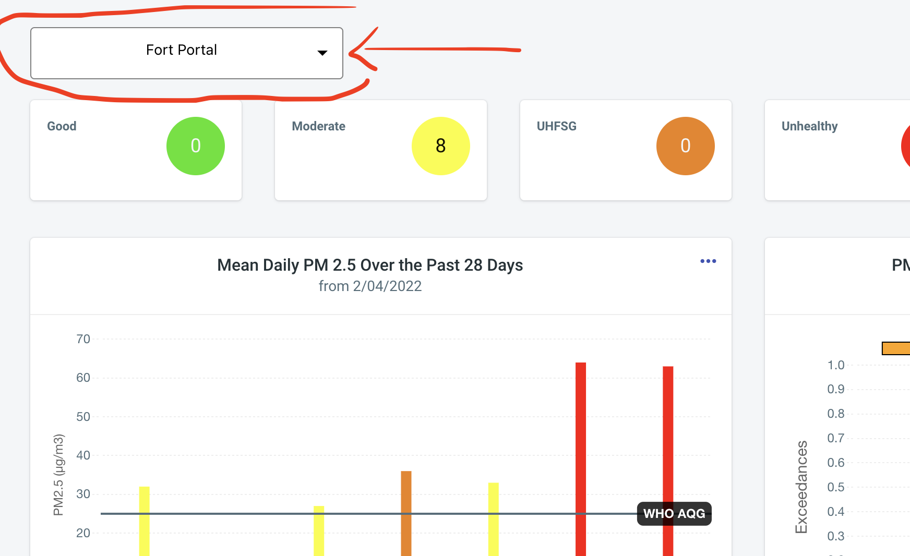
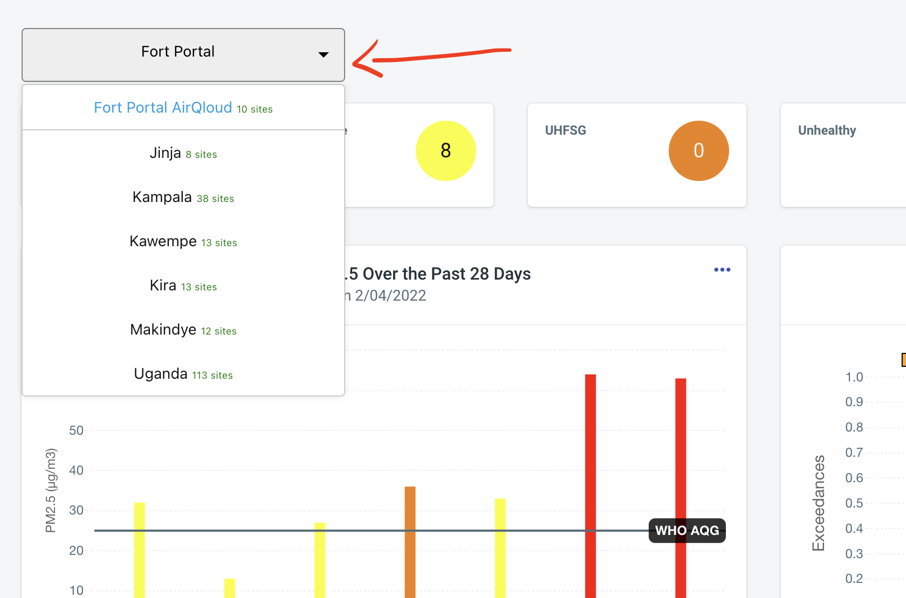
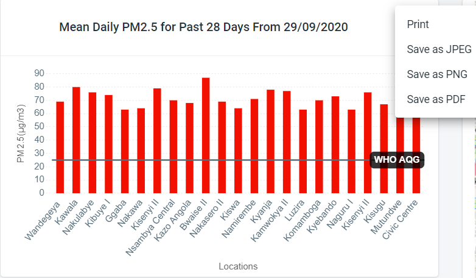
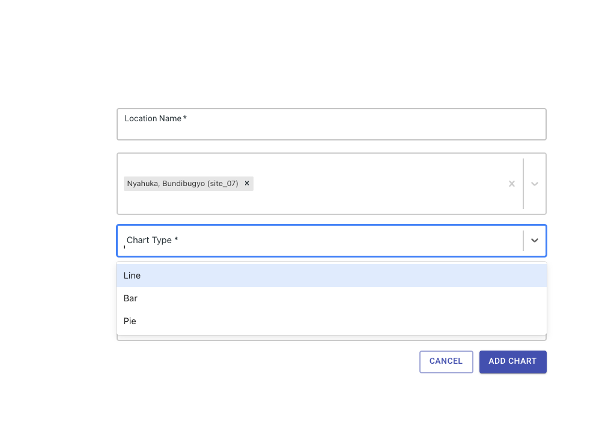
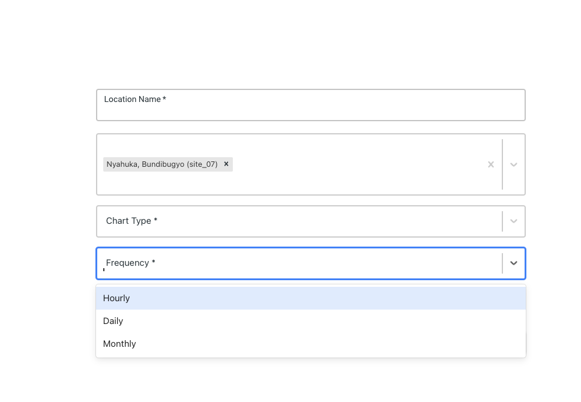
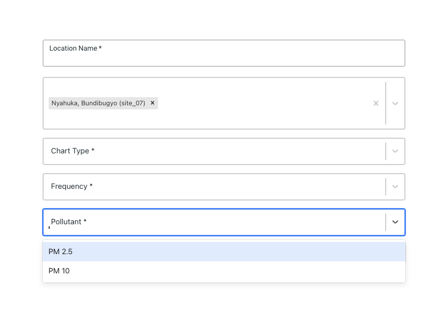

# Analytics dashboard

On successful login you will be directed directly to the dashboard, this is the starting point for all activities with AirQo Analytics.

---

## Select Location

The platform provides a drop down menu which enables you to easily select a city or location of interest. This ensures that all your analysis on the page just focuses on that Location's Sites.

|  |
| :----------------------------------------------------------------: |
|       <b>The selection of the Fort Portal City/AirQloud</b>        |

In the image above, the Fort Portal Location is selected. This means that all the content/data presented on the page will be fully focused on the Fort Portal Location. All the lower sections of the graph will provide data from the Fort Portal Sites only.

|                  |
| :--------------------------------------------------------------------------------: |
| <b>The opened dropdown where you get to select an AirQloud/Location of choice.</b> |

Image above indicates the various locations for selection. A user is free to select any location as long as they are configured to access it. At the moment, all users are able to access data for all locations as long as they have an AirQo dashboard account.

---

## Region status cards

Across the top of the dashboard, you will see the below cards.

These cards show the number of air quality monitors in the AirQo network and the quality of the air they are recording in real-time.

For example, the diagram above shows that 11 monitors are recording moderate air quality 25 monitors are recording air quality is unhealthy for sensitive groups (UHFSG) 57 monitors are recording unhealthy air quality while 5 monitors are recording very unhealthy air quality

---

## Mean daily PM

This chart shows the 24 hour mean (average) PM <small>2.5</small> levels for each device location for the last complete 28 days, usually from the day before the present day. This provides a medium term comparison of air quality in different locations. The colour of the bar represents the risk category at the location according to AQI. WHO Air Quality Guideline thresholds are shown by the horizontal line.

By clicking on the ellipsis (...), the 3 dots in the top right hand corner of the chart a drop down menu appears. The chart can be printed, exported as a pdf, jpeg, or png. jpeg and png are most suitable formats for including in reports or social media, either will do the job.

---

## Exceedances

Exceedances measure the number of days in the past 28 days for which daily pollutant levels have exceeded a minimum threshold for each location. The default view is EPA and the bar height shows the number of days that mean 24 hour levels have been above Moderate. The bars are further broken down so users can also see the number of days above the threshold for Unhealthy for sensitive groups, Unhealthy, Very unhealthy or Hazardous. In most cases values are above moderate for 28 the full 28 days.

To switch between WHO and AQI thresholds select the ellipsis / three dots (...) in the top right hand corner of the chart and select ‘Customize charts’. For WHO the chart shows the number of days in the past 28 days where the mean is above the WHO Air Quality Guideline of 25 μg/m3. In many cases NO2 levels are well below WHO and EPA levels so no values are visible.

Also, by clicking on the ellipsis (...) 3 dots in the top right hand corner of the chart, the charts can be printed, exported as a pdf, jpeg, or png. jpeg and png are most suitable for including in reports or social media.

---

## Customisable Charts

Click on the add chart button Fill in the below option and once done, click the add chart button to see your data.

**Step by step on how to access your data**
The Location name represents the title of your data that you want to view/download. Choose a preferred name that represents the group of sites you intend to select under the site’s section.

Add the sites you want to see. You can add as many locations/sites as you wish.

Choose the chart type, whether a bar chart, line graph or pie chart.

Select the frequency, whether monthly, daily or hourly means.
Choose according to the time period;

1. If you want to see air quality for a day or two days - hourly will be most appropriate,
2. For air quality for up to a month or two months then daily will be most appropriate.
3. Finally, choose monthly for longer-term air quality views
   

Finally, choose the pollutant either PM2.5 or PM10.

Once done, click the add chart button and you will be able to view your data.
To change the settings for the chart click on the ellipsis or three dots (...) in the top right-hand corner of the chart. You will have options to change the following variables

- Location name, site, chart type, Frequency, pollutant as well as time range whether 30 days, 90 days or custom range that allows you to set your own start and end dates.

**How to delete your chart**
Click the ellipsis (...) or the 3 dots in the top right-hand corner of the chart. A drop-down menu appears click delete to delete your chart.
