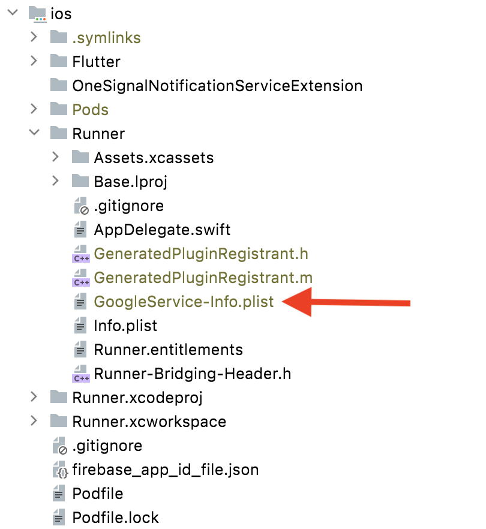

# AirQo mobile app

## **Prerequisites**

- [Flutter](https://docs.flutter.dev/get-started/install). Make sure all checks pass when you run `flutter doctor`
- [Android Sdk Tools](https://developer.android.com/studio)
- An emulator or phyiscal device. This app isn't configured to run in the browser.

## **Setup**

### **Add the configuration files**

| File                                   | Directory      |
|---------------------------------------|------------------|
| [google-services.json]()        | `app` directory under android folder (`android/app/`) |
| [google-services.json]()        | `app/src/airqodev` directory under android folder (`android/app/`)(For the staging environment) |
| [firebase_app_id_file.json]()        | Android folder (`android/`) |
| [key.properties]()                   | Android folder (`android/`) |
| [local.properties]()      | Android folder (`android/`) |
| [.env.dev]()      | App root directory (this directory) |
| **.env.prod**     | App root directory (this directory). Create an empty file named `.env.prod`. |
| [airqo-dev-keystore.jks]()      | Place it in any secure directory on your computer |
| [GoogleService-Info.plist]()      | `airqo` directory `ios/config` folder (`ios/config/`)
| [GoogleService-Info.plist]()      | `airqodev` directory under `ios/config` folder (`ios/config/`)(For the staging environment)

### **Update variables in configuration files**

- Change `sdk.dir` and `flutter.sdk` to point to the correct paths for your android Sdk anf flutter respectively
  - Path for `flutter.sdk` can be gotten from running `flutter doctor -v`.
  \
  For example `flutter.sdk=/opt/homebrew/Caskroom/flutter/2.5.1/flutter`
  \
  \
  
  
- Change `storeFile` variable in `key.properties` file to point to where you put `airqo-dev-keystore.jks`.
For example if `airqo-dev-keystore.jks` is located under `/Users/example/` then `storeFile=/Users/example/airqo-dev-keystore.jks`

### **Complete Setup**

Your project  structure should be similar the the following after adding all the required configuration files.

- #### **Android folder**

  

- #### **iOS folder**

  

- #### **Root folder**

  

### **Android signing certificates**

Run the command below to get your SHA-1 signing-certificate fingerprint. Share the Key with an AirQo team member to add it to the application restricted fingerprints.

```bash
keytool -list -v -keystore ~/.android/debug.keystore -alias androiddebugkey -storepass android -keypass android
```

## **Running the application**
###   **To simply run the app, Use the following:**
```bash
flutter run
```
###   **To run the staging environment, Use the following:**
#### **Staging in debug mode.**
```bash
flutter run --flavor airqodev -t lib/main_dev.dart
```
#### **Staging in release mode.**
```bash
flutter run --flavor airqodev -t lib/main_dev.dart --release
```

###   **To run the Production environment, You can use the following:**
#### **Production in debug mode.**
```bash
flutter run --flavor airqo -t lib/main.dart
```
#### **Production in release mode.**
```bash
flutter run --flavor airqo -t lib/main.dart --release
```
  

## **Useful commands**

### **Code formatting and analysis**

```bash
flutter packages pub run build_runner build --delete-conflicting-outputs
dart fix --dry-run
dart fix --apply
flutter format lib/
flutter pub run dart_code_metrics:metrics analyze lib --reporter=html
flutter pub run dart_code_metrics:metrics check-unused-files lib
flutter pub run dart_code_metrics:metrics check-unused-code lib
```

### **Building for release**

```bash
flutter build appbundle --obfuscate --split-debug-info=${PWD}/obfuscate
flutter build ipa --obfuscate --split-debug-info=${PWD}/obfuscate
flutter build appbundle [--analyze-size]
flutter build ipa [--analyze-size]
```

## **Security Guidelines**
We strive to follow an established industry standard for mobile application security from the  OWASP (the Open Web Application Security Project), The OWASP Mobile Application Security Verification Standard (MASVS) provides a set of baseline security criteria for developers. For a detailed security guide. Check out  the  [MASVS Level 1 requirements.](https://github.com/appdefensealliance/ASA/blob/main/MobileAppSecurityAssessment/MobileSecurityGuide.md)
